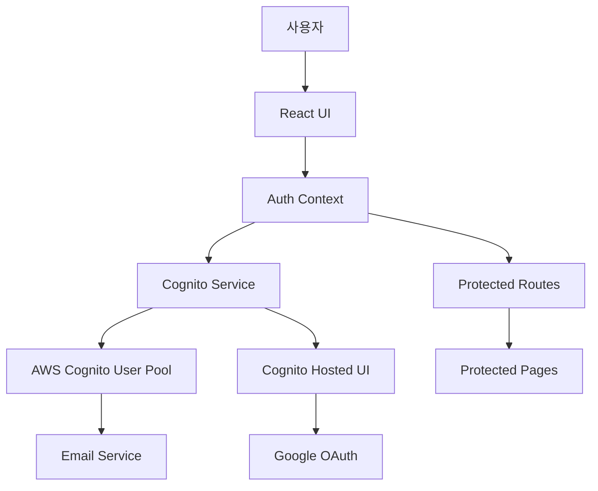
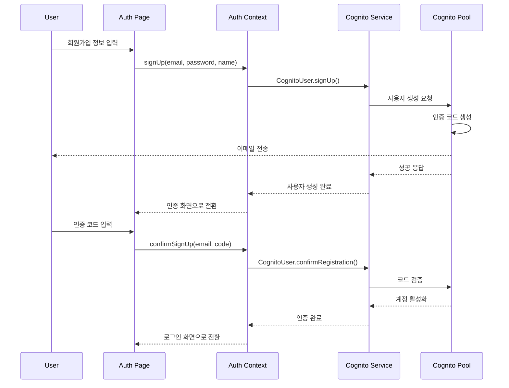
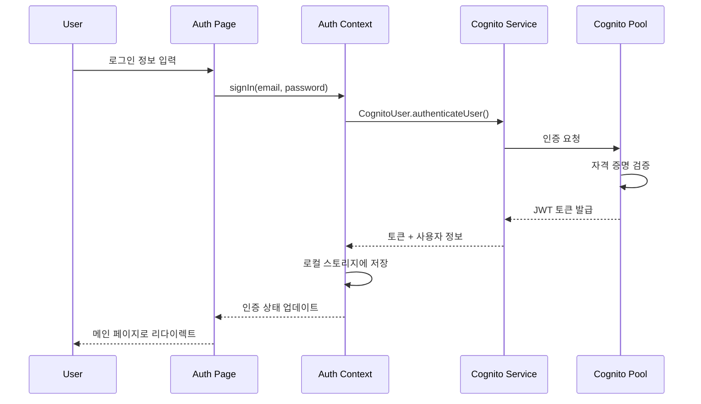
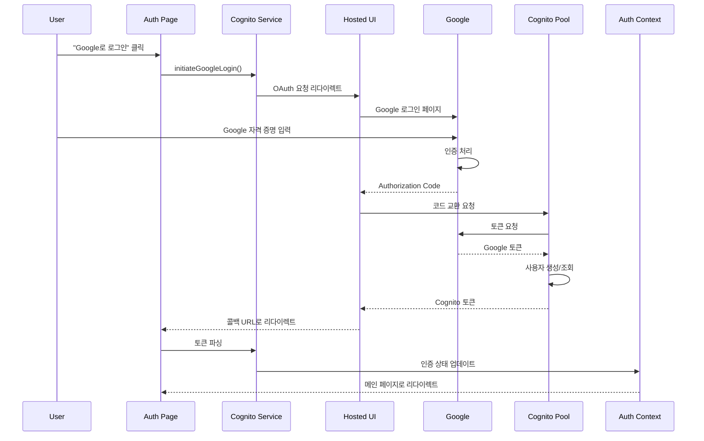

# Design Document: AWS Cognito Authentication System

## Overview

이 설계 문서는 FProject 웹 애플리케이션에 AWS Cognito를 통합하여 안전하고 확장 가능한 사용자 인증 시스템을 구현하는 방법을 설명합니다. 

### 핵심 목표
- AWS Cognito User Pool을 사용한 사용자 관리
- 이메일/비밀번호 기반 인증
- Google OAuth 2.0 소셜 로그인
- React Context API를 통한 전역 인증 상태 관리
- 보호된 라우트 구현
- 테스트 환경에 최적화된 설정

### 기술 스택
- **Frontend**: React 18 + TypeScript + Vite
- **인증 라이브러리**: amazon-cognito-identity-js
- **상태 관리**: React Context API + useReducer
- **라우팅**: React Router v6
- **UI**: 기존 커스텀 UI 컴포넌트 활용
- **AWS 서비스**: Cognito User Pool, Cognito Hosted UI

## Architecture

### 시스템 아키텍처 다이어그램



### 인증 플로우

#### 1. 이메일/비밀번호 회원가입 플로우


#### 2. 이메일/비밀번호 로그인 플로우


#### 3. Google 소셜 로그인 플로우


## Components and Interfaces

### 1. Cognito Service Layer

**파일**: `src/services/cognitoService.ts`

이 서비스는 AWS Cognito와의 모든 상호작용을 캡슐화합니다.

```typescript
// Cognito 설정 인터페이스
interface CognitoConfig {
  userPoolId: string;
  clientId: string;
  region: string;
  domain: string;
}

// 사용자 정보 인터페이스
interface CognitoUser {
  username: string;
  email: string;
  name?: string;
  sub: string;
  emailVerified: boolean;
}

// 인증 결과 인터페이스
interface AuthResult {
  accessToken: string;
  idToken: string;
  refreshToken: string;
  user: CognitoUser;
}

class CognitoService {
  private userPool: CognitoUserPool;
  private config: CognitoConfig;

  constructor(config: CognitoConfig);
  
  // 회원가입
  signUp(email: string, password: string, name: string): Promise<void>;
  
  // 이메일 인증
  confirmSignUp(email: string, code: string): Promise<void>;
  
  // 로그인
  signIn(email: string, password: string): Promise<AuthResult>;
  
  // Google 로그인 URL 생성
  getGoogleLoginUrl(): string;
  
  // 콜백에서 토큰 파싱
  parseAuthCallback(url: string): Promise<AuthResult>;
  
  // 로그아웃
  signOut(): Promise<void>;
  
  // 비밀번호 재설정 요청
  forgotPassword(email: string): Promise<void>;
  
  // 비밀번호 재설정 확인
  confirmPassword(email: string, code: string, newPassword: string): Promise<void>;
  
  // 현재 세션 가져오기
  getCurrentSession(): Promise<AuthResult | null>;
  
  // 토큰 갱신
  refreshSession(refreshToken: string): Promise<AuthResult>;
  
  // 인증 코드 재전송
  resendConfirmationCode(email: string): Promise<void>;
}
```

### 2. Auth Context

**파일**: `src/contexts/AuthContext.tsx`

React Context API를 사용하여 애플리케이션 전역에서 인증 상태를 관리합니다.

```typescript
// 인증 상태 타입
type AuthState = {
  isAuthenticated: boolean;
  isLoading: boolean;
  user: CognitoUser | null;
  tokens: {
    accessToken: string;
    idToken: string;
    refreshToken: string;
  } | null;
  error: string | null;
};

// 인증 액션 타입
type AuthAction =
  | { type: 'AUTH_START' }
  | { type: 'AUTH_SUCCESS'; payload: AuthResult }
  | { type: 'AUTH_FAILURE'; payload: string }
  | { type: 'AUTH_LOGOUT' }
  | { type: 'AUTH_REFRESH'; payload: AuthResult };

// Context 값 인터페이스
interface AuthContextValue {
  state: AuthState;
  signUp: (email: string, password: string, name: string) => Promise<void>;
  confirmSignUp: (email: string, code: string) => Promise<void>;
  signIn: (email: string, password: string) => Promise<void>;
  signInWithGoogle: () => void;
  signOut: () => Promise<void>;
  forgotPassword: (email: string) => Promise<void>;
  confirmPassword: (email: string, code: string, newPassword: string) => Promise<void>;
  resendCode: (email: string) => Promise<void>;
}

// Provider 컴포넌트
const AuthProvider: React.FC<{ children: React.ReactNode }>;

// Hook
const useAuth: () => AuthContextValue;
```

**상태 관리 로직**:
- `useReducer`를 사용하여 복잡한 인증 상태 관리
- 로컬 스토리지에 토큰 저장 및 복원
- 자동 토큰 갱신 로직
- 에러 처리 및 로딩 상태 관리

### 3. Protected Route Component

**파일**: `src/components/auth/ProtectedRoute.tsx`

인증이 필요한 라우트를 보호하는 컴포넌트입니다.

```typescript
interface ProtectedRouteProps {
  children: React.ReactNode;
  redirectTo?: string;
}

const ProtectedRoute: React.FC<ProtectedRouteProps> = ({
  children,
  redirectTo = '/auth'
}) => {
  const { state } = useAuth();
  const location = useLocation();

  if (state.isLoading) {
    return <LoadingSpinner />;
  }

  if (!state.isAuthenticated) {
    // 로그인 후 원래 페이지로 돌아가기 위해 현재 위치 저장
    return <Navigate to={redirectTo} state={{ from: location }} replace />;
  }

  return <>{children}</>;
};
```

### 4. Auth Callback Handler

**파일**: `src/pages/AuthCallback.tsx`

Google 로그인 후 Cognito Hosted UI에서 리다이렉트되는 콜백을 처리합니다.

```typescript
const AuthCallback: React.FC = () => {
  const navigate = useNavigate();
  const location = useLocation();
  const { signInWithGoogle } = useAuth();

  useEffect(() => {
    const handleCallback = async () => {
      try {
        // URL에서 인증 코드 파싱 및 토큰 교환
        await signInWithGoogle();
        
        // 원래 가려던 페이지 또는 메인 페이지로 이동
        const from = location.state?.from?.pathname || '/';
        navigate(from, { replace: true });
      } catch (error) {
        console.error('Auth callback error:', error);
        navigate('/auth', { replace: true });
      }
    };

    handleCallback();
  }, []);

  return <LoadingSpinner message="로그인 처리 중..." />;
};
```

### 5. Updated Auth Page

**파일**: `src/pages/Auth.tsx` (기존 파일 수정)

기존 UI를 유지하면서 실제 Cognito 연동 로직을 추가합니다.

주요 변경사항:
- `useAuth` hook 사용
- 실제 API 호출로 대체
- Google 로그인 버튼 추가
- 에러 처리 개선
- 로딩 상태 관리

## Data Models

### 1. 로컬 스토리지 구조

```typescript
// 키: 'cognito_tokens'
interface StoredTokens {
  accessToken: string;
  idToken: string;
  refreshToken: string;
  expiresAt: number; // Unix timestamp
}

// 키: 'cognito_user'
interface StoredUser {
  username: string;
  email: string;
  name?: string;
  sub: string;
  emailVerified: boolean;
}
```

### 2. Cognito User Pool 속성

User Pool에 저장될 사용자 속성:
- `sub` (자동 생성, UUID)
- `email` (필수, 로그인 식별자)
- `email_verified` (이메일 인증 상태)
- `name` (선택, 사용자 이름/닉네임)
- `identities` (소셜 로그인 정보, Google 연동 시 자동 생성)

### 3. JWT 토큰 구조

**ID Token Payload**:
```json
{
  "sub": "user-uuid",
  "email": "user@example.com",
  "email_verified": true,
  "name": "User Name",
  "cognito:username": "user@example.com",
  "iss": "https://cognito-idp.region.amazonaws.com/userPoolId",
  "aud": "clientId",
  "token_use": "id",
  "auth_time": 1234567890,
  "exp": 1234571490
}
```

**Access Token**: API 호출 시 사용
**Refresh Token**: 토큰 갱신 시 사용 (유효기간 30일)

## Correctness Properties

*A property is a characteristic or behavior that should hold true across all valid executions of a system—essentially, a formal statement about what the system should do. Properties serve as the bridge between human-readable specifications and machine-verifiable correctness guarantees.*

이 섹션에서는 AWS Cognito 인증 시스템이 만족해야 하는 correctness properties를 정의합니다. 각 property는 property-based testing을 통해 검증됩니다.

### Property 1: 유효한 회원가입 데이터는 항상 성공해야 함

*For any* valid email, password (8+ characters with special characters), and name, calling `signUp()` should successfully create a user account and transition to the verification screen.

**Validates: Requirements 2.1, 2.4**

### Property 2: 정책 위반 비밀번호는 항상 거부되어야 함

*For any* password that violates the policy (less than 8 characters or missing special characters), calling `signUp()` should reject the registration and return a clear error message.

**Validates: Requirements 2.2**

### Property 3: 유효한 자격 증명으로 로그인 시 토큰과 사용자 정보를 반환해야 함

*For any* registered user with valid email and password, calling `signIn()` should return authentication tokens (accessToken, idToken, refreshToken) and user information, and update the auth context state.

**Validates: Requirements 3.1, 3.2**

### Property 4: 잘못된 자격 증명은 항상 거부되어야 함

*For any* invalid email or password combination, calling `signIn()` should reject the login attempt and return an appropriate error message.

**Validates: Requirements 3.3**

### Property 5: 세션 지속성 - 토큰 저장 후 복원 가능해야 함

*For any* valid authentication session, after storing tokens to local storage, reloading the application should restore the authentication state with the same user information.

**Validates: Requirements 3.5, 7.3**

### Property 6: 인증 코드 검증은 올바른 코드에 대해 성공해야 함

*For any* valid 6-digit confirmation code, calling `confirmSignUp()` should activate the account and allow subsequent login.

**Validates: Requirements 2.5**

### Property 7: 콜백 URL의 인증 코드는 토큰으로 교환 가능해야 함

*For any* valid authorization code in the OAuth callback URL, calling `parseAuthCallback()` should successfully exchange it for Cognito tokens and user information.

**Validates: Requirements 4.3, 4.5**

### Property 8: 비밀번호 재설정 요청은 유효한 이메일에 대해 성공해야 함

*For any* registered user email, calling `forgotPassword()` should send a password reset code without revealing whether the email exists.

**Validates: Requirements 5.1**

### Property 9: 유효한 재설정 코드와 새 비밀번호로 비밀번호 변경 가능해야 함

*For any* valid reset code and new password that meets policy requirements, calling `confirmPassword()` should successfully update the password.

**Validates: Requirements 5.2**

### Property 10: 정책 위반 새 비밀번호는 재설정 시 거부되어야 함

*For any* new password that violates the policy, calling `confirmPassword()` should reject the password change and return an error message.

**Validates: Requirements 5.3**

### Property 11: 로그아웃은 모든 토큰과 세션을 제거해야 함

*For any* authenticated user, calling `signOut()` should clear all tokens from local storage, reset the auth context state to unauthenticated, and trigger navigation to the login page.

**Validates: Requirements 6.1, 6.2**

### Property 12: 만료된 액세스 토큰은 자동으로 갱신되어야 함

*For any* expired access token with a valid refresh token, the system should automatically call `refreshSession()` and obtain new tokens without user intervention.

**Validates: Requirements 6.3**

### Property 13: 크로스 탭 로그아웃 동기화

*For any* logout action in one browser tab, all other tabs should detect the storage change event and synchronize to the logged-out state.

**Validates: Requirements 6.5**

### Property 14: Cognito 에러 코드는 한국어 메시지로 변환되어야 함

*For any* Cognito API error code, the error handler should return a user-friendly Korean error message.

**Validates: Requirements 10.1**

## Error Handling

### 에러 타입 및 처리 전략

#### 1. Cognito API 에러
```typescript
enum CognitoErrorCode {
  UserNotFoundException = 'UserNotFoundException',
  NotAuthorizedException = 'NotAuthorizedException',
  UserNotConfirmedException = 'UserNotConfirmedException',
  CodeMismatchException = 'CodeMismatchException',
  ExpiredCodeException = 'ExpiredCodeException',
  InvalidPasswordException = 'InvalidPasswordException',
  UsernameExistsException = 'UsernameExistsException',
  LimitExceededException = 'LimitExceededException',
  TooManyRequestsException = 'TooManyRequestsException',
}

const errorMessages: Record<CognitoErrorCode, string> = {
  UserNotFoundException: '사용자를 찾을 수 없습니다.',
  NotAuthorizedException: '이메일 또는 비밀번호가 올바르지 않습니다.',
  UserNotConfirmedException: '이메일 인증이 필요합니다.',
  CodeMismatchException: '인증 코드가 올바르지 않습니다.',
  ExpiredCodeException: '인증 코드가 만료되었습니다. 새 코드를 요청해주세요.',
  InvalidPasswordException: '비밀번호는 8자 이상이며 특수문자를 포함해야 합니다.',
  UsernameExistsException: '이미 사용 중인 이메일입니다.',
  LimitExceededException: '시도 횟수를 초과했습니다. 잠시 후 다시 시도해주세요.',
  TooManyRequestsException: '너무 많은 요청이 발생했습니다. 잠시 후 다시 시도해주세요.',
};
```

#### 2. 네트워크 에러
- 자동 재시도 로직 (최대 3회)
- 재시도 옵션을 사용자에게 제공
- 오프라인 상태 감지 및 알림

#### 3. 토큰 만료 에러
- Refresh Token을 사용한 자동 갱신
- Refresh Token도 만료 시 자동 로그아웃
- 사용자에게 세션 만료 알림

#### 4. 검증 에러
- 클라이언트 측 사전 검증 (이메일 형식, 비밀번호 정책)
- 실시간 피드백 제공
- 명확한 에러 메시지

### 에러 처리 플로우
```typescript
async function handleCognitoError(error: any): Promise<never> {
  // 에러 로깅
  console.error('Cognito Error:', error);

  // 에러 코드 추출
  const errorCode = error.code || error.name;

  // 한국어 메시지 변환
  const message = errorMessages[errorCode as CognitoErrorCode] 
    || '알 수 없는 오류가 발생했습니다. 다시 시도해주세요.';

  // 토스트로 사용자에게 표시
  toast({
    title: '오류',
    description: message,
    variant: 'destructive',
  });

  throw new Error(message);
}
```

## Testing Strategy

### 이중 테스트 접근법

이 프로젝트는 **Unit Tests**와 **Property-Based Tests**를 모두 사용하여 포괄적인 테스트 커버리지를 달성합니다.

#### Unit Tests
- **목적**: 특정 예제, 엣지 케이스, 에러 조건 검증
- **도구**: Vitest + React Testing Library
- **범위**:
  - 특정 에러 시나리오 (중복 이메일, 만료된 코드 등)
  - UI 컴포넌트 렌더링 및 상호작용
  - Protected Route 리다이렉션 로직
  - 환경 변수 로딩 및 검증
  - 에러 메시지 변환

#### Property-Based Tests
- **목적**: 모든 입력에 대한 보편적 속성 검증
- **도구**: fast-check (JavaScript/TypeScript용 property-based testing 라이브러리)
- **설정**: 각 테스트는 최소 100회 반복 실행
- **범위**:
  - 회원가입/로그인 플로우의 일반적 동작
  - 토큰 저장 및 복원 로직
  - 비밀번호 정책 검증
  - 세션 관리 및 갱신
  - 크로스 탭 동기화

### Property-Based Testing 설정

**라이브러리 설치**:
```bash
npm install --save-dev fast-check
```

**테스트 구조**:
```typescript
import fc from 'fast-check';
import { describe, it, expect } from 'vitest';

describe('Cognito Authentication Properties', () => {
  it('Property 1: Valid signup data always succeeds', () => {
    // Feature: cognito-authentication, Property 1: 유효한 회원가입 데이터는 항상 성공해야 함
    fc.assert(
      fc.asyncProperty(
        fc.emailAddress(),
        fc.string({ minLength: 8 }).filter(pwd => /[!@#$%^&*]/.test(pwd)),
        fc.string({ minLength: 1, maxLength: 50 }),
        async (email, password, name) => {
          const result = await cognitoService.signUp(email, password, name);
          expect(result).toBeDefined();
          expect(result.userConfirmed).toBe(false);
        }
      ),
      { numRuns: 100 }
    );
  });
});
```

### 테스트 태깅 규칙

모든 property-based test는 다음 형식의 주석으로 태그를 달아야 합니다:
```typescript
// Feature: cognito-authentication, Property {number}: {property_text}
```

### 테스트 파일 구조

```
src/
├── services/
│   ├── cognitoService.ts
│   └── cognitoService.test.ts          # Unit tests
│   └── cognitoService.properties.test.ts  # Property tests
├── contexts/
│   ├── AuthContext.tsx
│   └── AuthContext.test.tsx            # Unit tests
│   └── AuthContext.properties.test.ts  # Property tests
├── components/
│   └── auth/
│       ├── ProtectedRoute.tsx
│       └── ProtectedRoute.test.tsx     # Unit tests
└── pages/
    ├── Auth.tsx
    └── Auth.test.tsx                   # Unit tests
```

### Mock 전략

**최소한의 Mocking 원칙**:
- 실제 Cognito API 호출은 테스트 User Pool을 사용하여 통합 테스트
- 네트워크 레이어만 필요시 mock
- UI 테스트에서는 CognitoService를 mock

**테스트 User Pool 설정**:
- 별도의 테스트 전용 Cognito User Pool 생성
- 테스트 환경 변수로 분리
- 테스트 후 자동 정리 (cleanup)

### 테스트 실행

```bash
# 모든 테스트 실행
npm test

# Property-based tests만 실행
npm test -- --grep "Property"

# 특정 파일 테스트
npm test cognitoService.properties.test.ts

# 커버리지 포함
npm test -- --coverage
```

## Implementation Notes

### 환경 변수 설정

**파일**: `.env` (로컬 개발용)

```env
# AWS Cognito Configuration
VITE_COGNITO_REGION=ap-northeast-2
VITE_COGNITO_USER_POOL_ID=ap-northeast-2_xxxxxxxxx
VITE_COGNITO_CLIENT_ID=xxxxxxxxxxxxxxxxxxxxxxxxxx
VITE_COGNITO_DOMAIN=your-app-domain.auth.ap-northeast-2.amazoncognito.com

# OAuth Configuration
VITE_OAUTH_REDIRECT_URI=http://localhost:5173/auth/callback
VITE_OAUTH_LOGOUT_URI=http://localhost:5173/auth
```

**파일**: `.env.example` (버전 관리용 템플릿)

```env
# AWS Cognito Configuration
VITE_COGNITO_REGION=
VITE_COGNITO_USER_POOL_ID=
VITE_COGNITO_CLIENT_ID=
VITE_COGNITO_DOMAIN=

# OAuth Configuration
VITE_OAUTH_REDIRECT_URI=
VITE_OAUTH_LOGOUT_URI=
```

### 의존성 패키지

```json
{
  "dependencies": {
    "amazon-cognito-identity-js": "^6.3.12"
  },
  "devDependencies": {
    "fast-check": "^3.15.0",
    "@types/node": "^20.11.0"
  }
}
```

### 라우팅 설정

**파일**: `src/App.tsx` 또는 라우터 설정 파일

```typescript
import { BrowserRouter, Routes, Route } from 'react-router-dom';
import { AuthProvider } from './contexts/AuthContext';
import ProtectedRoute from './components/auth/ProtectedRoute';
import Auth from './pages/Auth';
import AuthCallback from './pages/AuthCallback';
import MainPage from './pages/MainPage';
// ... other imports

function App() {
  return (
    <BrowserRouter>
      <AuthProvider>
        <Routes>
          <Route path="/auth" element={<Auth />} />
          <Route path="/auth/callback" element={<AuthCallback />} />
          
          <Route path="/" element={
            <ProtectedRoute>
              <MainPage />
            </ProtectedRoute>
          } />
          
          {/* 다른 보호된 라우트들 */}
          <Route path="/library" element={
            <ProtectedRoute>
              <LibraryPage />
            </ProtectedRoute>
          } />
          
          {/* ... */}
        </Routes>
      </AuthProvider>
    </BrowserRouter>
  );
}
```

### 보안 고려사항

1. **토큰 저장**: 
   - 로컬 스토리지 사용 (XSS 공격에 주의)
   - 프로덕션에서는 HttpOnly 쿠키 고려
   
2. **HTTPS 필수**: 
   - 프로덕션 환경에서는 반드시 HTTPS 사용
   - OAuth 리다이렉트 URI도 HTTPS여야 함

3. **환경 변수 보호**:
   - `.env` 파일은 `.gitignore`에 포함
   - 민감한 정보는 절대 커밋하지 않음

4. **CORS 설정**:
   - Cognito User Pool에서 허용된 도메인만 설정
   - 개발 환경과 프로덕션 환경 분리

5. **Rate Limiting**:
   - Cognito의 기본 rate limit 인지
   - 클라이언트 측에서도 중복 요청 방지

## Deployment Considerations

### 개발 환경
- 로컬 개발 서버: `http://localhost:5173`
- 테스트 User Pool 사용
- Google OAuth 테스트 앱 설정

### 프로덕션 환경
- HTTPS 필수
- 별도의 프로덕션 User Pool
- 프로덕션 도메인으로 OAuth 리다이렉트 URI 업데이트
- 환경 변수를 배포 플랫폼의 시크릿 관리 시스템에 저장

### CI/CD 파이프라인
- 테스트 자동 실행
- Property-based tests 포함
- 환경별 설정 자동 주입
- 배포 전 통합 테스트

## Future Enhancements

1. **추가 소셜 로그인**: Facebook, Apple, Kakao 등
2. **MFA (Multi-Factor Authentication)**: SMS 또는 TOTP 기반
3. **사용자 프로필 관리**: 프로필 사진, 추가 정보 업데이트
4. **비밀번호 변경**: 로그인 상태에서 비밀번호 변경
5. **계정 삭제**: 사용자가 직접 계정 삭제
6. **세션 타임아웃 경고**: 만료 전 사용자에게 알림
7. **Remember Me**: 로그인 상태 장기 유지 옵션
