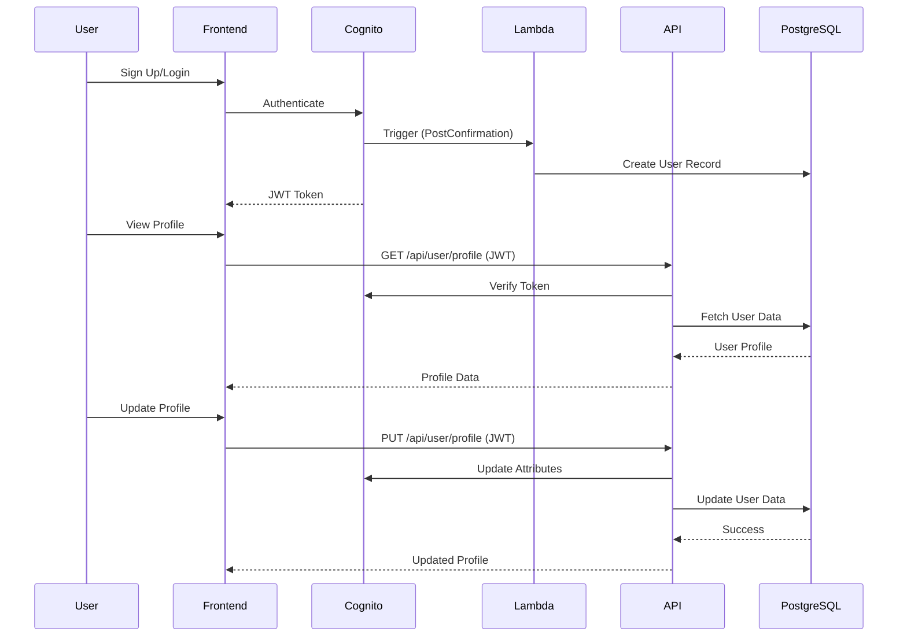

# Design Document: User Profile Management System

## Overview

This system integrates AWS Cognito authentication with PostgreSQL database to provide comprehensive user profile management. The architecture consists of:
- Frontend React application with TypeScript
- AWS Cognito for authentication
- PostgreSQL database (AWS RDS) for extended user data
- Lambda functions for Cognito-PostgreSQL synchronization
- REST API backend for profile management operations

## Architecture

### High-Level Architecture

```
┌─────────────────┐
│  React Frontend │
│   (TypeScript)  │
└────────┬────────┘
         │
         ├──────────────────┐
         │                  │
         ▼                  ▼
┌─────────────────┐  ┌──────────────┐
│  AWS Cognito    │  │  Backend API │
│  (Auth Service) │  │  (Express)   │
└────────┬────────┘  └──────┬───────┘
         │                  │
         │                  ▼
         │           ┌──────────────┐
         │           │  PostgreSQL  │
         │           │  (EC2)       │
         │           └──────────────┘
         │
         ▼
┌─────────────────┐
│ Lambda Triggers │
│  (Sync Handler) │
└─────────────────┘
```

### Component Interaction Flow



## Components and Interfaces

### 1. Database Schema (PostgreSQL)

#### Users Table
```sql
CREATE TABLE users (
    user_id VARCHAR(255) PRIMARY KEY,  -- Cognito sub
    email VARCHAR(255) UNIQUE NOT NULL,
    nickname VARCHAR(50) UNIQUE NOT NULL,
    status VARCHAR(20) DEFAULT 'active',  -- active, inactive, deleted
    created_at TIMESTAMP DEFAULT CURRENT_TIMESTAMP,
    updated_at TIMESTAMP DEFAULT CURRENT_TIMESTAMP,
    deleted_at TIMESTAMP NULL
);

CREATE INDEX idx_users_email ON users(email);
CREATE INDEX idx_users_status ON users(status);
```

#### User Profiles Table
```sql
CREATE TABLE user_profiles (
    profile_id SERIAL PRIMARY KEY,
    user_id VARCHAR(255) UNIQUE NOT NULL,
    profile_image_url TEXT,
    bio TEXT CHECK (LENGTH(bio) <= 500),
    phone_number VARCHAR(20),
    additional_info JSONB,
    created_at TIMESTAMP DEFAULT CURRENT_TIMESTAMP,
    updated_at TIMESTAMP DEFAULT CURRENT_TIMESTAMP,
    FOREIGN KEY (user_id) REFERENCES users(user_id) ON DELETE CASCADE
);

CREATE INDEX idx_user_profiles_user_id ON user_profiles(user_id);
```

#### User Reports Table
```sql
CREATE TABLE user_reports (
    report_id SERIAL PRIMARY KEY,
    reporter_id VARCHAR(255) NOT NULL,
    reported_user_id VARCHAR(255) NOT NULL,
    reason VARCHAR(50) NOT NULL,  -- spam, harassment, inappropriate_content, other
    description TEXT CHECK (LENGTH(description) <= 1000),
    status VARCHAR(20) DEFAULT 'pending',  -- pending, reviewed, resolved
    created_at TIMESTAMP DEFAULT CURRENT_TIMESTAMP,
    reviewed_at TIMESTAMP NULL,
    FOREIGN KEY (reporter_id) REFERENCES users(user_id),
    FOREIGN KEY (reported_user_id) REFERENCES users(user_id),
    CONSTRAINT different_users CHECK (reporter_id != reported_user_id)
);

CREATE INDEX idx_user_reports_reporter ON user_reports(reporter_id);
CREATE INDEX idx_user_reports_reported ON user_reports(reported_user_id);
CREATE INDEX idx_user_reports_status ON user_reports(status);
```

#### User Inquiries Table
```sql
CREATE TABLE user_inquiries (
    inquiry_id SERIAL PRIMARY KEY,
    user_id VARCHAR(255) NOT NULL,
    subject VARCHAR(200) NOT NULL,
    message TEXT CHECK (LENGTH(message) <= 2000) NOT NULL,
    status VARCHAR(20) DEFAULT 'pending',  -- pending, answered, closed
    response TEXT,
    created_at TIMESTAMP DEFAULT CURRENT_TIMESTAMP,
    answered_at TIMESTAMP NULL,
    FOREIGN KEY (user_id) REFERENCES users(user_id)
);

CREATE INDEX idx_user_inquiries_user_id ON user_inquiries(user_id);
CREATE INDEX idx_user_inquiries_status ON user_inquiries(status);
```

### 2. Backend API Service

#### Database Connection Module (`src/services/database.ts`)

```typescript
interface DatabaseConfig {
  host: string;
  port: number;
  database: string;
  user: string;
  password: string;
  max: number;  // connection pool size
  idleTimeoutMillis: number;
  connectionTimeoutMillis: number;
}

interface DatabaseService {
  query<T>(sql: string, params: any[]): Promise<T[]>;
  transaction<T>(callback: (client: any) => Promise<T>): Promise<T>;
  close(): Promise<void>;
}
```

#### User Service Module (`src/services/userService.ts`)

```typescript
interface UserProfile {
  userId: string;
  email: string;
  nickname: string;
  profileImageUrl?: string;
  bio?: string;
  phoneNumber?: string;
  status: 'active' | 'inactive' | 'deleted';
  createdAt: Date;
  updatedAt: Date;
}

interface UpdateProfileRequest {
  nickname?: string;
  profileImageUrl?: string;
  bio?: string;
  phoneNumber?: string;
}

interface UserService {
  getUserProfile(userId: string): Promise<UserProfile>;
  updateUserProfile(userId: string, updates: UpdateProfileRequest): Promise<UserProfile>;
  deleteUser(userId: string): Promise<void>;
  checkNicknameAvailability(nickname: string, excludeUserId?: string): Promise<boolean>;
}
```

#### Report Service Module (`src/services/reportService.ts`)

```typescript
interface UserReport {
  reportId: number;
  reporterId: string;
  reportedUserId: string;
  reason: 'spam' | 'harassment' | 'inappropriate_content' | 'other';
  description?: string;
  status: 'pending' | 'reviewed' | 'resolved';
  createdAt: Date;
}

interface CreateReportRequest {
  reporterId: string;
  reportedUserId: string;
  reason: string;
  description?: string;
}

interface ReportService {
  createReport(report: CreateReportRequest): Promise<UserReport>;
  checkDuplicateReport(reporterId: string, reportedUserId: string): Promise<boolean>;
}
```

#### Inquiry Service Module (`src/services/inquiryService.ts`)

```typescript
interface UserInquiry {
  inquiryId: number;
  userId: string;
  subject: string;
  message: string;
  status: 'pending' | 'answered' | 'closed';
  response?: string;
  createdAt: Date;
  answeredAt?: Date;
}

interface CreateInquiryRequest {
  userId: string;
  subject: string;
  message: string;
}

interface InquiryService {
  createInquiry(inquiry: CreateInquiryRequest): Promise<UserInquiry>;
  getUserInquiries(userId: string): Promise<UserInquiry[]>;
}
```

### 3. Cognito Integration Service

#### Auth Service Module (`src/services/authService.ts`)

```typescript
interface CognitoUser {
  sub: string;
  email: string;
  email_verified: boolean;
  preferred_username: string;
}

interface AuthService {
  verifyToken(token: string): Promise<CognitoUser>;
  updateCognitoAttribute(userId: string, attributeName: string, value: string): Promise<void>;
  deleteUser(userId: string): Promise<void>;
  initiatePasswordReset(email: string): Promise<void>;
  confirmPasswordReset(email: string, code: string, newPassword: string): Promise<void>;
}
```

### 4. Lambda Sync Handler

#### PostConfirmation Trigger (`lambda/postConfirmation.js`)

```javascript
// Triggered after user confirms signup
exports.handler = async (event) => {
  const { sub, email, preferred_username } = event.request.userAttributes;
  
  // Insert user into PostgreSQL
  await insertUser({
    userId: sub,
    email: email,
    nickname: preferred_username,
    status: 'active'
  });
  
  // Create empty profile
  await insertUserProfile({
    userId: sub
  });
  
  return event;
};
```

#### PostAuthentication Trigger (`lambda/postAuthentication.js`)

```javascript
// Triggered after successful authentication
exports.handler = async (event) => {
  const { sub } = event.request.userAttributes;
  
  // Update last login timestamp
  await updateUserLastLogin(sub);
  
  return event;
};
```

### 5. Frontend Components

#### MyPage Component (`src/pages/MyPage.tsx`)

```typescript
interface MyPageProps {}

interface MyPageState {
  profile: UserProfile | null;
  isLoading: boolean;
  isEditing: boolean;
  error: string | null;
}

// Sections:
// - Profile Information Display
// - Edit Profile Form
// - Password Reset
// - Account Deletion
// - Inquiry History
```

#### ProfileEditForm Component (`src/components/profile/ProfileEditForm.tsx`)

```typescript
interface ProfileEditFormProps {
  profile: UserProfile;
  onSave: (updates: UpdateProfileRequest) => Promise<void>;
  onCancel: () => void;
}

// Fields:
// - Nickname (with availability check)
// - Profile Image Upload
// - Bio (textarea, max 500 chars)
// - Phone Number (with format validation)
```

#### ReportUserDialog Component (`src/components/report/ReportUserDialog.tsx`)

```typescript
interface ReportUserDialogProps {
  reportedUserId: string;
  reportedUserNickname: string;
  onSubmit: (report: CreateReportRequest) => Promise<void>;
}

// Fields:
// - Reason (dropdown: spam, harassment, inappropriate_content, other)
// - Description (textarea, max 1000 chars, optional)
```

#### InquiryForm Component (`src/components/inquiry/InquiryForm.tsx`)

```typescript
interface InquiryFormProps {
  onSubmit: (inquiry: CreateInquiryRequest) => Promise<void>;
}

// Fields:
// - Subject (input, max 200 chars)
// - Message (textarea, max 2000 chars)
```

## Data Models

### TypeScript Interfaces

```typescript
// User Profile
export interface UserProfile {
  userId: string;
  email: string;
  nickname: string;
  profileImageUrl?: string;
  bio?: string;
  phoneNumber?: string;
  status: 'active' | 'inactive' | 'deleted';
  createdAt: Date;
  updatedAt: Date;
}

// Update Profile Request
export interface UpdateProfileRequest {
  nickname?: string;
  profileImageUrl?: string;
  bio?: string;
  phoneNumber?: string;
}

// User Report
export interface UserReport {
  reportId: number;
  reporterId: string;
  reportedUserId: string;
  reason: 'spam' | 'harassment' | 'inappropriate_content' | 'other';
  description?: string;
  status: 'pending' | 'reviewed' | 'resolved';
  createdAt: Date;
}

// User Inquiry
export interface UserInquiry {
  inquiryId: number;
  userId: string;
  subject: string;
  message: string;
  status: 'pending' | 'answered' | 'closed';
  response?: string;
  createdAt: Date;
  answeredAt?: Date;
}

// API Response
export interface ApiResponse<T> {
  success: boolean;
  data?: T;
  error?: string;
  message?: string;
}
```

## Correctness Properties

*A property is a characteristic or behavior that should hold true across all valid executions of a system—essentially, a formal statement about what the system should do. Properties serve as the bridge between human-readable specifications and machine-verifiable correctness guarantees.*

### Property 1: User synchronization consistency
*For any* user created in Cognito, there must exist a corresponding record in the PostgreSQL users table with matching user_id (sub) and email.
**Validates: Requirements 2.1**

### Property 2: Profile update atomicity
*For any* profile update request, either both Cognito and PostgreSQL are updated successfully, or neither is updated (rollback on failure).
**Validates: Requirements 4.1, 4.2, 4.3, 4.4**

### Property 3: Nickname uniqueness
*For any* two different users, their nicknames must be unique across both Cognito (preferred_username) and PostgreSQL (nickname column).
**Validates: Requirements 4.1**

### Property 4: Soft delete preservation
*For any* deleted user, the user record in PostgreSQL must have status='deleted' and deleted_at timestamp set, while the Cognito user is permanently removed.
**Validates: Requirements 6.3, 6.4**

### Property 5: Report self-prevention
*For any* report submission, the reporter_id must not equal the reported_user_id.
**Validates: Requirements 7.1**

### Property 6: Report duplicate prevention
*For any* user pair (reporter, reported), there can be at most one pending report within a 24-hour period.
**Validates: Requirements 7.6**

### Property 7: Input validation consistency
*For any* user input (nickname, bio, subject, message), the validation rules must be enforced consistently across frontend, API, and database constraints.
**Validates: Requirements 4.1, 4.3, 7.2, 7.4, 8.1**

### Property 8: Authentication requirement
*For any* API endpoint (except public endpoints), a valid Cognito JWT token must be provided and verified before processing the request.
**Validates: Requirements 10.9**

### Property 9: Error message safety
*For any* error response, internal system details (database errors, stack traces) must not be exposed to the client.
**Validates: Requirements 9.6**

### Property 10: Connection pool efficiency
*For any* database operation, connections must be acquired from the pool, used, and released properly without leaks.
**Validates: Requirements 9.1**

## Error Handling

### Database Errors
- Connection failures: Retry with exponential backoff (3 attempts)
- Query errors: Log error, return generic message to client
- Transaction failures: Rollback and return error state
- Constraint violations: Return specific validation error

### Cognito Errors
- Token verification failures: Return 401 Unauthorized
- Attribute update failures: Rollback database changes
- User not found: Return 404 Not Found
- Rate limiting: Return 429 Too Many Requests

### Validation Errors
- Invalid input format: Return 400 Bad Request with field-specific errors
- Duplicate values: Return 409 Conflict with descriptive message
- Missing required fields: Return 400 Bad Request

### Synchronization Errors
- Cognito-PostgreSQL sync failures: Log error, queue for retry
- Partial update failures: Rollback all changes
- Lambda trigger failures: Log error, alert monitoring system

## Testing Strategy

### Unit Tests
- Database service: Connection pooling, query execution, transaction handling
- User service: CRUD operations, validation logic
- Auth service: Token verification, Cognito API calls
- Validation functions: Input format, length, uniqueness checks

### Property-Based Tests
- Property 1: Generate random Cognito users, verify PostgreSQL records exist
- Property 2: Generate random profile updates, verify atomicity
- Property 3: Generate random nicknames, verify uniqueness constraint
- Property 4: Generate random user deletions, verify soft delete behavior
- Property 5: Generate random report submissions, verify self-report prevention
- Property 6: Generate random reports, verify duplicate prevention within 24h
- Property 7: Generate random inputs, verify validation consistency
- Property 8: Generate random API requests, verify authentication requirement
- Property 9: Generate random error conditions, verify safe error messages
- Property 10: Generate concurrent database operations, verify no connection leaks

### Integration Tests
- End-to-end user signup flow (Cognito → Lambda → PostgreSQL)
- Profile update flow (Frontend → API → Cognito + PostgreSQL)
- Password reset flow (Frontend → Cognito)
- Account deletion flow (Frontend → API → Cognito + PostgreSQL)
- Report submission flow (Frontend → API → PostgreSQL)
- Inquiry submission flow (Frontend → API → PostgreSQL)

### Testing Configuration
- Use `fast-check` library for property-based testing in TypeScript
- Minimum 100 iterations per property test
- Each property test tagged with: **Feature: user-profile-management, Property {N}: {description}**
- Use test database for integration tests
- Mock Cognito API calls in unit tests
- Use Docker container for PostgreSQL in CI/CD

## Security Considerations

### Database Security
- Use parameterized queries to prevent SQL injection
- Encrypt sensitive data (phone numbers) at rest
- Use environment variables for credentials
- Implement connection pooling with max connections limit
- Enable SSL/TLS for database connections

### API Security
- Verify Cognito JWT tokens on every request
- Implement rate limiting (100 requests/minute per user)
- Validate and sanitize all user inputs
- Use HTTPS for all API communications
- Implement CORS with whitelist

### Data Privacy
- Soft delete users (retain for 30 days for recovery)
- Anonymize deleted user data after 30 days
- Log access to sensitive user data
- Implement data export functionality (GDPR compliance)

## Environment Configuration

### Environment Variables

```bash
# PostgreSQL Configuration
DB_HOST=your-rds-endpoint.rds.amazonaws.com
DB_PORT=5432
DB_NAME=fproject_db
DB_USER=fproject_user
DB_PASSWORD=<secure_password>
DB_MAX_CONNECTIONS=20
DB_IDLE_TIMEOUT=30000
DB_CONNECTION_TIMEOUT=5000

# AWS Cognito Configuration
AWS_REGION=ap-northeast-2
COGNITO_USER_POOL_ID=ap-northeast-2_vjP7q3xVS
COGNITO_CLIENT_ID=1cfeckerodebr30utvjev6v0cm

# API Configuration
API_PORT=3000
API_BASE_URL=http://localhost:3000
JWT_SECRET=<secure_secret>

# Frontend Configuration
VITE_API_BASE_URL=http://localhost:3000
```

## Deployment Considerations

### Database Setup
1. Create PostgreSQL database on AWS RDS
2. Run migration scripts to create tables and indexes
3. Configure security groups to allow API server access
4. Set up automated backups

### Lambda Deployment
1. Deploy PostConfirmation trigger to AWS Lambda
2. Deploy PostAuthentication trigger to AWS Lambda
3. Configure Lambda IAM roles with PostgreSQL access
4. Attach triggers to Cognito User Pool

### API Deployment
1. Deploy Express API server (EC2 or ECS)
2. Configure environment variables
3. Set up load balancer and auto-scaling
4. Configure CloudWatch logging and monitoring

### Frontend Deployment
1. Build React application
2. Deploy to S3 + CloudFront or Vercel
3. Configure environment variables for production
4. Set up CI/CD pipeline
